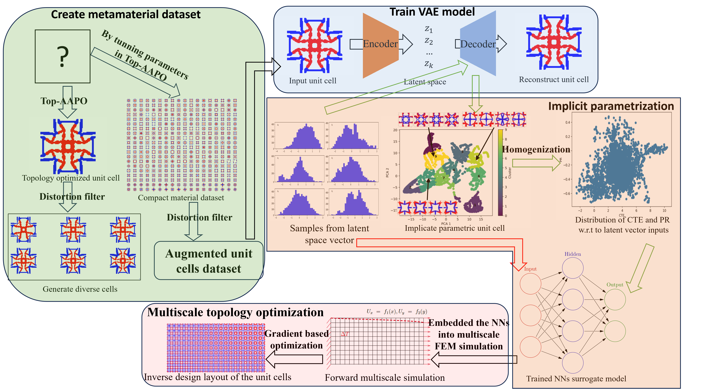

# VAE manage data
## Graphic abstract 

  
  
 VAE-driven implicit geomatry parametriclization.

## Information 
Use Variational AutoEncoders (VAE) to paramatrilize  unit cels with complex microstrucure features.

Normally, we need run model on GPUs but reuse the model on CPU machine, here [tips](https://pytorch.org/tutorials/recipes/recipes/save_load_across_devices.html) on save and load models across devices in Pytorch.

## Repositry

- [ ] Source code in `./src/`
- [ ] Saved models in `./src/save/`
- [ ] Reuse model demo in `./reuse_mode_after_train_CPU.ipynb`

## Demo

### unit cell strucrue

Data can be dowmload from [Dropbox](https://www.dropbox.com/scl/fo/xqdwyfjq1lhgu1pv7iqfu/h?rlkey=jlaoermw6k5sj107kzw5bj0fk&dl=0).

## Cite paper

@article{chu2024exploring,
  title={Exploring VAE-driven implicit parametric unit cells for multiscale topology optimization},
  author={Chu, Chenchen and Leichner, Alexander and Wenz, Franziska and Andr{\"a}, Heiko},
  journal={Materials \& Design},
  volume={244},
  pages={113087},
  year={2024},
  publisher={Elsevier}
}

